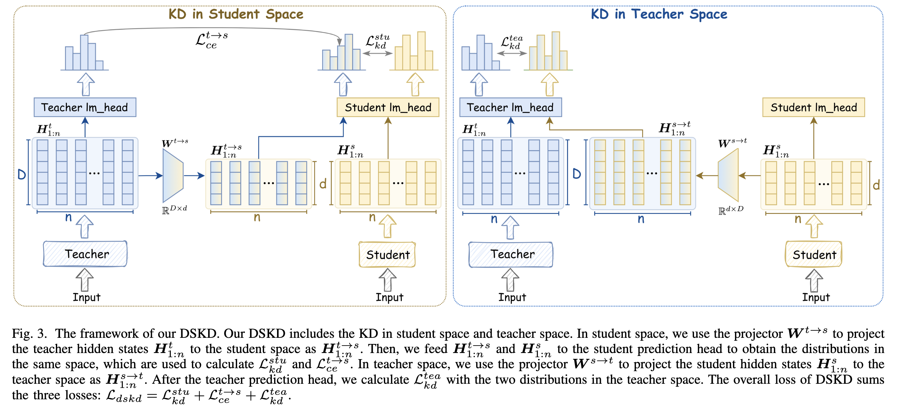
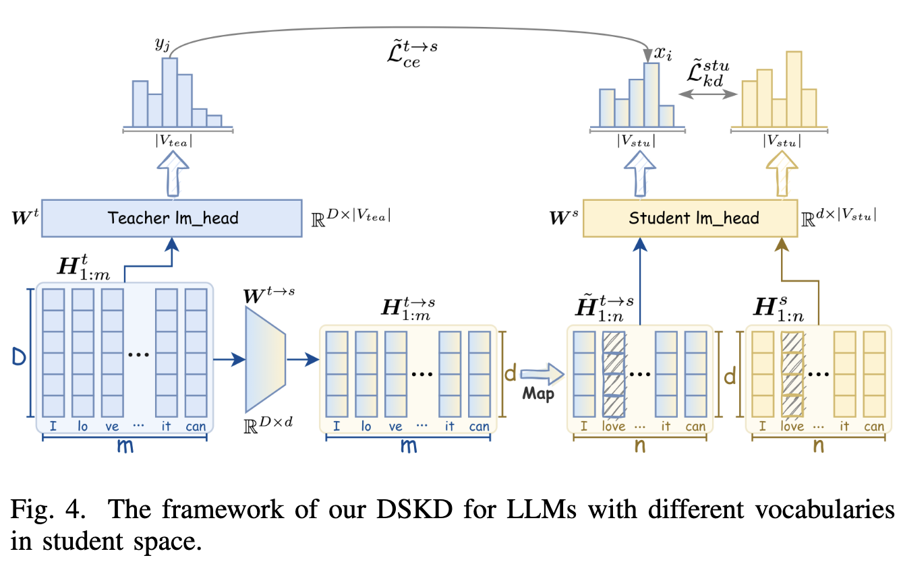

# DSKD v2

The official implementation of the paper "[A Dual-Space Framework for General Knowledge Distillation of Large Language Models](https://arxiv.org/abs/2504.11426)", an extended version of [DSKD](https://github.com/songmzhang/DSKD) in EMNLP 2024.

<p align="center">
  
</p>

## 🔥 News

- **[2025.04]** Paper released on arXiv: [A Dual-Space Framework for General Knowledge Distillation of Large Language Models](https://arxiv.org/abs/2504.11426)

## 📖 Overview

**DSKD v2** (Dual-Space Knowledge Distillation v2) is a general knowledge distillation framework for large language models (LLMs). 
It supports both same/cross-tokenizer distillation, off/on-policy distillation and various divergence objectives.
On the basis of the original DSKD, we have the following improvement:
- **Projector Initialization**: DSKD introduces two/three randomly initialized projectors that may disturb the training at the begining. To solve this, we develop projector initialization based on the logit identity assumption, which significantly reduces the projection error and improves the performance.
- **Exact Token Alignment (EMA)**: The cross-model attention mechanism automatically learns the alignment relationship between two differently-tokenized sequences. However, it also **increases randomness** in the representation and brings difficulty for training at the begining. Based on the observation that tokens are largely overlapped between different-tokenized sequence, we directly find the tokens that are exactly aligned and calculate the distillation loss on them.
- **On-Policy Distillation**: We also show the superior performance of our DSKDv2 under on-policy distillation，by comparing it with several on-policy distillation algorithms.


### Key Features

- **Dual-Space Distillation**: Performs knowledge transfer in both student and teacher representation spaces
- **Cross-Tokenizer Distillation**: Handles teacher and student models with different tokenizers via token alignment
- **Multiple Divergence Objectives**: Supports various KL divergence variants (Forward KL, Reverse KL, JS Divergence, Adaptive KL, Skewed KL)
- **Off/On-Policy Distillation**: Supports both off-policy and on-policy training scenarios
- **LoRA Support**: Compatible with Parameter-Efficient Fine-Tuning (PEFT) methods
- **DeepSpeed Integration**: Distributed training with DeepSpeed ZeRO optimization

## 🛠️ Installation

### Requirements

```bash
pip install torch>=2.0.0
pip install transformers>=4.30.0
pip install deepspeed>=0.10.0
pip install peft>=0.5.0
pip install datasets
pip install rouge-score
```

### Clone the Repository

```bash
git clone https://github.com/songmzhang/DSKDv2.git
cd DSKDv2
```

## 📁 Project Structure

```
DSKDv2/
├── code/
│   ├── distillation.py          # Main training script
│   ├── distiller.py             # Distiller class with model loading and projectors
│   ├── arguments.py             # Command-line arguments
│   ├── criterions/              # Loss functions
│   │   ├── dual_space_kd_v2.py           # DSKD v2 implementation
│   │   ├── dual_space_kd_v2_with_eta.py  # DSKD v2 with Exact Token Alignment
│   │   ├── dual_space_kd_with_cma.py     # DSKD with Cross-Model Attention
│   │   ├── various_divergence.py         # Various divergence implementations
│   │   └── ...
│   ├── data_utils/              # Dataset processing utilities
│   └── analysis/                # Analysis scripts
├── configs/
│   └── deepspeed/               # DeepSpeed configuration files
├── scripts/                     # Training scripts
│   └── dolly/gpt2/              # Example scripts for GPT-2 distillation
└── figures/                     # Framework diagrams
```

## 🚀 Quick Start

### 1. Prepare Data

Organize your training data in the following format:
```json
{"prompt": "Your input prompt", "response": "Expected response"}
```

### 2. Run Training

Training scripts are provided in the `scripts/` directory. For example, to run DSKD v2 distillation:

```bash
bash scripts/dolly/gpt2/run_dskdv2.sh
```

## 🔬 Cross-Tokenizer Distillation

DSKD v2 supports distillation between models with different tokenizers:

<p align="center">
  
</p>

In DSKD v2, we find that different tokenizers tend to have large overlaps after tokenizing the same texts.
Thus, different from DSKD that uses a cross-model attention for token alignment, we directly develop an exact token alignment (ETA) algorithm to find the tokens that are overlapped by the two tokenizers and calculate the distillation loss on these tokens.

## 📝 Citation

If you find this work useful, please cite our paper:

```bibtex
@article{zhang2025dskdv2,
  title={A Dual-Space Framework for General Knowledge Distillation of Large Language Models},
  author={Zhang, Xue and Zhang, Songming and Liang, Yunlong and Meng, Fandong and Chen, Yufeng and Xu, Jinan and Zhou, Jie},
  journal={arXiv preprint arXiv:2504.11426},
  year={2025}
}

@article{zhang2024dskd,
  title={Dual-space knowledge distillation for large language models},
  author={Zhang, Songming and Zhang, Xue and Sun, Zengkui and Chen, Yufeng and Xu, Jinan},
  journal={arXiv preprint arXiv:2406.17328},
  year={2024}
}
